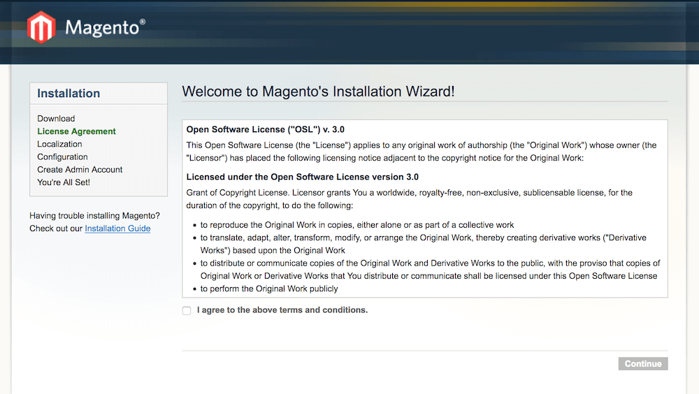

# Урок 0: Подготавливаемся к работе

Перед тем, как начать разбираться с устройством Magento нам необходимо подготовить окружение и установить ее локально на свою рабочую машину. Для работы нам понадобятся:

- IDE (рекомендую [PhpStorm](https://www.jetbrains.com/phpstorm/))
- Git и аккаунт на [GitHub](https://github.com/)
- Локальный web-сервер или [Docker](https://www.docker.com/)
- [Composer](https://getcomposer.org/)

## Готовим репозиторий
Первым делом необходимо форкнуть этот репозиторий на GitHub`е. Именно в вашем новом репозитории должны производиться все правки. 

## Docker
Если у вас есть опыт работы с Docker, то у нас отличная новость - мы подготовили стэк, который можно запустить буквально одной командой (см. файл [docker-compose.yml](../docker-compose.yml) в корне). В контейнер _mageintern_phpfpm_ уже включены Composer и n98-magerun (о нем будет рассказано отдельно).

Если пока нет опыта работы с ним, то не расстраивайтесь. Можете изучить [наш небольшой гайд](extra/docker.md) и попробовать разобраться с ним. Это будет очень полезный опыт, поскольку мы используем Docker в наших проектах.

## Настройка web-сервера
Если предпочтение отдается локальному web-серверу, то он должен включать в свой стэк следующие компоненты:

#### Nginx
В абсолютном большинстве наших проектов используется Nginx, поэтому настоятельно рекомендую использовать именно его. Если предпочтение отдается Apache, то Magento умеет работать и с ним. Однако с настройкой конфигурации придется разбираться самостоятельно.

Для Nginx уже существует конфиг, который стоит взять за основу для настройки: [main.conf](../dev/docker/nginx/vhosts/main.conf).

**Важно!** Необходимо настроить на development домен второго уровня, поскольку для домена _localhost_ браузер Chrome не будут сохраняться cookies. В нашем примере мы будем использовать домен _magento.loc_. Поэтому добавьте в ваш hosts-файл строку следующего вида:
```
127.0.0.1   magento.loc www.magento.loc
```

#### PHP-FPM
Мы будем использовать PHP 5.6 с набором следующих расширений: pdo_mysql, dom, curl, gd, iconv, mcrypt, simplexml, soap. Все они обычно идут в стандартной поставке.

Также необходимо увеличить в конфигах PHP максимальное время работы скрипта, чтобы не прервалась установка Magento через web-интерфейс: _max_execution_time = 300_

#### MySQL
В качестве базы данных будем использовать классический MySQL 5.6. Также как альтернатива подойдут форки MariaDB или Percona.

## Установка Magento
Следующим шагом будет установка Magento через Composer. Для этого переходим в папку _src_ и выполняем команду:

```
composer install
```

Если установка прошла успешно, то при открытии страницы http://magento.loc/ мы увидим окно Мастера установки:



Далее просто следуйте инструкциям в установщике. На этапе _Configuration_ потребуется ввести данные для доступа к БД. Если вы используете наш docker stack, то нужно указать следующие параметры:

- **Host:** database
- **DB name:** magento_db
- **User:** magento_user
- **Password:** password

После завершения установки можно будет войти на сам сайт и в админку (проверьте доступы к ней).
