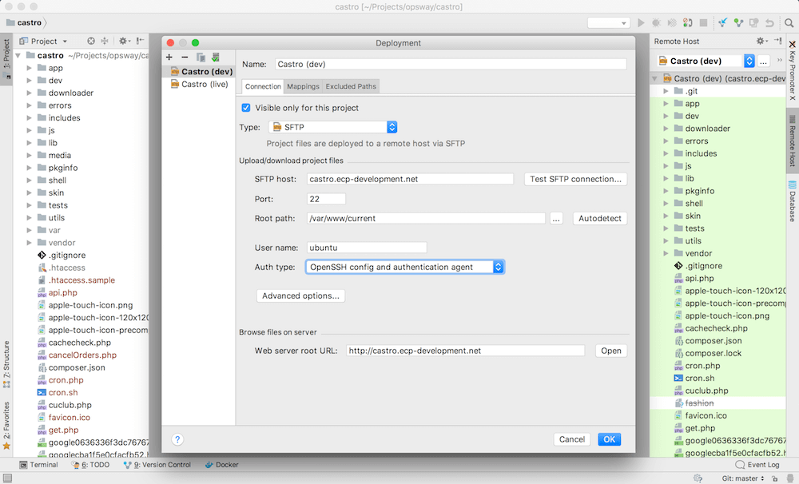

# PhpStorm: Cинхронизация файлов с удаленным сервером

В большинстве проектов мы ведем разработку на удаленных development серверах. При этом код проекта храним локально. Поэтому в процессе работы нам необходимо автоматически загружать файлы на сервер.

В этом гайде будет рассказано как настроить синхронизацию файлов с удаленным сервером через PhpStorm:

1. Склонируйте код из репозитория и откройте его в PhpStorm
2. Открываем меню _Tools > Deployment > Configuration..._
3. Добавляем новый сервер в список (иконка "+") и в открывшемся окне указываем название сервера (например "Project Name (dev)") и тип "SFTP".
4. Заполняем поля для настройки подключения. Не забудьте указать корректный путь к папке с проектом на сервере в поле _Root path_ (обычно это _/var/www/current/_).
5. Поскольку мы подключаемся по ключу, то укажите:
    - Auth type: Key pair (OpenSSH or PuTTY)
    - Private key: Путь к вашему приватному ключу
    - Key phrase: Ключевая фраза от приватного ключа
    
    Либо используйте _Auth type: OpenSSH config and authentification agent_ если ключ был добавлен локально в SSH Agent.
6. Во вкладке _Mapping_ в поле _Deployment path on server_ укажите значение _"/"_
7. Сохраните изменения и закройте окно

Если настройка прошла успешна, то во вкладке _Remote hosts_ будет отображен список файлов и папок с сервера. Важно чтобы они были подсвечены зеленым цветом, т.к. это говорит о том, что данные файлы и папки будут синхронизироваться с локальной копией.

Чтобы включить автоматическую загрузку файлов на сервер при их локальном изменении в IDE необходимо включить опцию _Tools > Deployment > Automatic Upload_.

